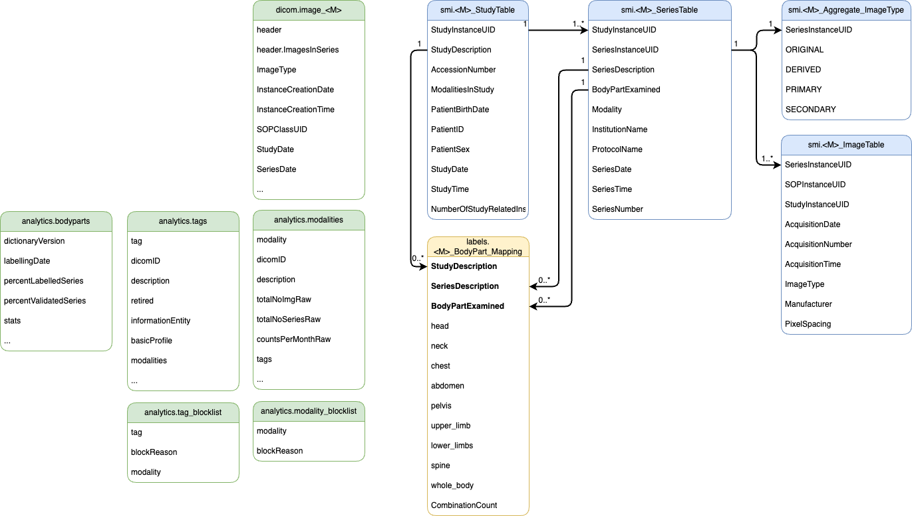

# Metacat docs

The structure of the DICOM metadata and how it's stored closely follows that of the live data and architecture in order to emulate the same challenges in a test environment:

Where:

- green is represented by MongoDB documents,
- blue by tables in either `data_load2` staging database or `smi` live database
- yellow by the `labels` database tables

## Templates

The [general_doc_schema.json](./general_doc_schema.json) is a template for synthetic document generation that gives some pipe-separated example values. You can change these values to affect the contents of synthetic documents.  

The [general_table_schema.jinjasql](./general_table_schema.jinjasql) is used for relational tables to be populated by document values.  

The other schemas are there to capture the format of the documents.
