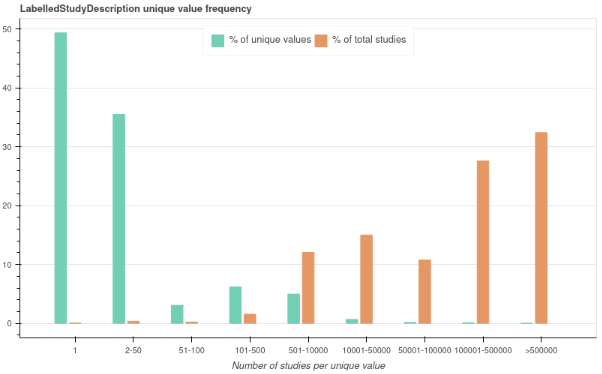

# Body part medical image labelling through tags

## Body part labelling

### By group of columns

Labelling can be done on the following three columns in the order of priority:

- `StudyDescription`
- `SeriesDescription`
- `BodyPartExamined`

If `StudyDescription` can be labelled, its labels will be applied to the group and a confidence percentage will be calculated. If this cannot be labelled, the labels of `SeriesDescription` will be applied to the group instead and if this can also not be labelled, the labels of `BodyPartExamined` are applied.  

For each label, the confidence percentage represents how many of the columns contain it. For example:  

| StudyDescription | SeriesDescription | BodyPartExamined | head | neck | chest | abdomen | pelvis | upper_limb | lower_limb | spine | whole_body | CombinationCount |
| ---------------- | ----------------- | ---------------- | ---- | ---- | ----- | ------- | ------ | ---------- | ---------- | ----- | ---------- | ---------------- |
| Thorac & abdo & pel | ABDOMEN/PELVIS | PELVIS           | NULL | NULL | 33.33 | 66.66   | 100.00 | NULL       | NULL       | NULL  | NULL       | 21 |

- 1 out of 3 columns have been labelled with `chest` so the confidence percentage for the `chest` label is 33%.
- 2 out of 3 columns have been labelled with `abdomen` so the confidence percentage for the `abdomen` label is 66%.
- 3 out of 3 columns have been labelled with `pelvis` so the confidence percentage for the `pelvis` label is 100%.

To run group labelling, use the following command for a specific modality:

```shell
$ python group_labelling.py -d <DATABASE> -t <TERMS_DICT> -m <MODALITY> -o <OUTPUT_DIR> -l <LOG_DIR>
```

For example:

```shell
$ python group_labelling.py -d smi -t data/terms.csv -m CT -o outputs -l logs
```

You can use the [create_tables.py](./create_tables.py) script to generate and populate tables with the output:

```shell
$ python create_tables.py -d <DATABASE> -m <MODALITY> -i <GROUP_LABELLING_OUTPUT> -l <LOG_DIR>
```

For example:

```shell
$ python create_tables.py -d labels -m CT -i outputs/CT_labelled_terms.csv -l logs
```

This command will create a `CT_BodyPart_Mapping` table in the `labels` database.

>**Note:** To run these scripts live, use the [run_group_labelling.sh](./scripts/run_group_labelling.sh) script.

### By column

For validation purposes, you may want to check the labelling on unique values. This script allows the collation of unique values for a given column from across modalities.

```shell
$ python tag_labelling.py -d <DATABASE> -c <COLUMN> -ta <TABLE> -t <TERM_DICT> -m <MOD_LIST> -o <OUTPUT_DIR> -l <LOG_DIR>
```

For example:  

```shell
$ python tag_labelling.py -d smi -c StudyDescription -ta StudyTable -t data/terms.csv -m CT,MR -o outputs -l logs
```

The table is determined by the level at which the column is recorded at in the database schema:

| Column | Table | Count |
| ------ | ----- | ----- |
| StudyDescription | Studytable | studies |
| SeriesDescription | SeriesTable | series |
| BodyPartExamined | SeriesTable | series |

This will output two lists, one of labelled and one of unlabelled values, modalities they are found in and count of records (studies or series, depending on the table) that have it.  

This will likely still be too large a number of values to manually validate. You want to focus on the values that cover the majority of cases rather than values that are only found in one or two studies. To decide which values these are, you can plot these results on a bar chart by using the [plot script](./plot.py):

```shell
$ python plot.py -t <TERMS_LABELLING_OUTPUT> -c <COUNT_COL_NAME> -b <series|studies> -o <OUTPUT_DIR> -l <LOG_DIR>
```

 For example:

```shell
$ python plot.py -t outputs/StudyDescription_labelled.csv -c StudyDescriptionCount -b studies -o outputs -l logs
```

This will save a chart as `html`:



This shows the number of studies per unique value as a percent of the total number of unique values (what proportion of the list generated by tag labelling they represent) versus as a percent of the total number of studies (what proportion of all the studies they represent).  

For example, in the above graph, more than 90% of unique values in the list represent only a few percentages of all the studies. Validation would be best focused on unique values with a count of over 500 studies because this is where the number of unique values start representing less of the list but more of the total number of studies.  

>**Note:** To run these scripts live, use the [run_tag_labelling.sh](./scripts/run_group_labelling.sh) script.

Once you have visually identified the cut-off point, you can split the list of terms using the [split.sh](./scripts/split.sh) script:

```shell
$ ./scripts/split.sh <TERMS_LABELLING_OUTPUT> <COUNTS_COL_POS> <CUTOFF_VALUE> <OUTPUT_FILE>_validate.csv
```

>**Note:** For generating stats, you need to make sure the output location is the same as the group and tag labelling outputs and that the file name contains `validate` in the name.

For example:

```shell
$ ./scripts/split.sh outputs/StudyDescription_col_labelled_YYYY-MM-DD.csv 4 500 outputs/StudyDescription_labelled_validate.csv
```

Edit the output file and add two additional columns: `ManualValidation` and `ManualValidationNotes`.  

>**Note:** For generating stats, you need to make sure the validation column names are as stated. Stats generation only looks at group labelling and StudyDescription validation. It also does not require a timestamp in the filename as the labelling date takes precedence.

Check the `Labels` column against the description and append a `,1,` for `correct` or a `,0,<REASON>` for `incorrect` to the row.  

Keep a note of any common issues and ideas you may have about them. See an example of this [here](./docs/manual_validation_notes.md). Check identified issues against the [log of known errors](./docs/known_error_log.md) and add any new issues.  

Once validated, you can generate stats:

```shell
$ python generate_stats.py -v <TERM_DICT_VERSION> -o <OUTPUT_FILES_LOCATION> -l <LOG_DIR>
```

For example:

```shell
$ python generate_stats.py -v e3d24be7 -o outputs -l logs
```

>**Note:** Because stats for validation across modalities are drawn from `StudyDescription`s only, this will miss out on cases where the StudyDescription was empty and the labelling took place on SeriesDescription. In the majority of cases, `StudyDescription` is completed and this discrepancy is expected to be small. This will mean the % of validated studies is likely to be a bit underestimated, however, the goal of these stats is to provide an approximate indication of the validation coverage.

>**Note:** Stats metadata will be updated based on dictionary version. This means you can generate stats at any stage (i.e., after group labelling, after tag labelling, or after validation) and it will update the stats for that labelling run.
